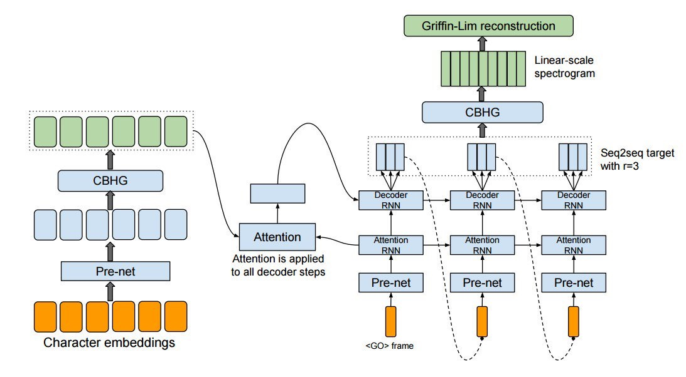

# A Pytorch Implementation of Tacotron: End-to-end Text-to-speech Deep-Learning Model
Implement google's [Tacotron](https://arxiv.org/abs/1703.10135) TTS system with pytorch. 


## Updates
2018/09/15 => Fix RNN feeding bug.  
2018/11/04 => Add attention mask and loss mask.  
2019/05/17 => 2nd version updated.  


## Requirements
See `used_packages.txt`.


## Usage

* Data  
Download [LJSpeech](https://keithito.com/LJ-Speech-Dataset/) provided by keithito. It contains 13100 short audio clips of a single speaker. The total length is approximately 24 hrs.

* Preprocessing
```bash
# Generate a directory 'training/' containing extracted features and a new meta file 'ljspeech_meta.txt'
$ python data/preprocess.py --output-dir training \ 
                            --data-dir <WHERE_YOU_PUT_YOUR_DATASET>/LJSpeech-1.1/wavs \
                            --old-meta <WHERE_YOU_PUT_YOUR_DATASET>/LJSpeech-1.1/metadata.csv \
                            --config config/config.yaml
```

* Split dataset
```bash
# Generate 'meta_train.txt' and 'meta_test.txt' in 'training/'
$ python data/train_test_split.py --meta-all training/ljspeech_meta.txt \ 
                                  --ratio-test 0.1
```

* Train
```bash
# Start training
$ python main.py --config config/config.yaml \
                 --checkpoint-dir <WHERE_TO_PUT_YOUR_CHECKPOINTS> 

# Restart training
$ python main.py --config config/config.yaml \
                 --checkpoint-dir <WHERE_TO_PUT_YOUR_CHECKPOINTS> \
                 --checkpoint-path <LAST_CHECKPOINT_PATH>
```

* Examine the training process
```bash
# Scalars : loss curve 
# Audio   : validation wavs
# Images  : validation spectrograms & attentions
$ tensorboard --logdir log
```

* Inference
```bash
# Generate synthesized speech 
$ python generate_speech.py --text "For example, Taiwan is a great place." \
                            --output <DESIRED_OUTPUT_PATH> \ 
                            --checkpoint-path <CHECKPOINT_PATH> \
                            --config config/config.yaml
```


## Samples
All the samples can be found [here](https://github.com/ttaoREtw/Tacotron-pytorch/tree/master/samples). These samples are generated after 102k updates.

## Alignment
Proper alignment occurs after **10k** steps of updating.


## Differences from the original Tacotron
1. Gradient clipping
2. Noam style learning rate decay (The mechanism that [Attention is all you need](https://arxiv.org/abs/1706.03762) applies.)


## Refenrence
[[link](https://arxiv.org/abs/1703.10135)] Original paper of Tacotron   
[[link](https://github.com/r9y9/tacotron_pytorch)] r9y9's implementation   
Finally, this is the code used in my work ["End-to-end Text-to-speech for Low-resource Languages by Cross-Lingual Transfer Learning"](https://arxiv.org/abs/1904.06508). 
